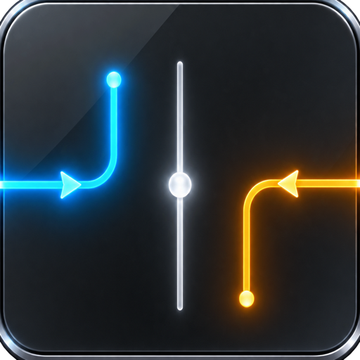

# EdgeControl

> 两个边缘，两种控制，仅此而已。

[](https://github.com/leecdiang/EdgeControl/releases) · [**English**](README.md)



EdgeControl 是一个开源、完全离线的 macOS 菜单栏应用：把内置触控板或选定的 Apple 外接触控板上**从外侧滑入边缘**的刻意手势，映射为连续的音量 / 亮度调节。

<br clear="left" />

## 用法

**手势从机身开始，而不是从触控板上开始。**

1. 用一根手指，**从 MacBook 机身边缘（触控板外侧）滑入触控板的左边缘或右边缘**——手指从触控板外部进入
2. 滑入后**立即沿着边缘向上或向下滑动**
3. 左边缘和右边缘可独立设置：关闭 / 音量 / 亮度
4. 手指**先在触控板内部落下**的，永远不触发——即使之后滑到边缘也一样

这不是普通的"碰到边缘再上下滑动"：contact 必须**出生在极窄的边缘入口条内**（只有从机身滑入才可能），并在短时间内建立明确的纵向意图。内部出生的 contact 在整个生命周期内被永久拒绝；任何多指帧都会拒绝整个生命周期，直到所有手指抬起。

## 状态

1.3.0 基线已于 2026-08-16/17 在 macOS 26.5（Apple Silicon MacBook Air）上完成真机验证。1.5.0 在 1.4.0 基础上新增三档触觉反馈，并把精简 HUD 改为更凝实的真实磨砂效果；发布前须完成 `OPENCLAW_VALIDATE_1.5.0.md` 的 macOS 矩阵。早期逐项证据见 [BUILD_REPORT.md](BUILD_REPORT.md)。

手势识别、打字保护、数值映射、亮度路由、触控板选择策略、档位、触觉反馈与设置层由 55 个单元测试方法覆盖。依赖未公开 macOS ABI 的代码全部通过 `dlopen`/`dlsym` 动态加载，符号缺失时优雅降级（该功能不可用，应用照常运行），而不是启动崩溃。

## 功能

- 物理左 / 右边缘滑入识别
- 左右边缘独立分配：关闭 / 音量 / 亮度
- 主开关、音量、亮度、触觉反馈、HUD、调节速度、误触保护、登录启动、外接显示器 DDC 等设置
- 独立三档调节速度：精细（`0.50×`）、标准（`0.70×`）、快速（`0.95×`）
- 独立三档误触保护：强（`600ms`、窄边缘）、标准（`350ms`）和轻（`200ms`、宽边缘）
- 以手势激活瞬间读取到的音量 / 亮度为锚点进行连续相对调节，手指从高位或低位滑入都不会让数值瞬间跳变
- CoreAudio 音量控制（默认输出设备变化自动重解析、不支持设备有处理）
- 运行时动态加载 DisplayServices 控制内屏亮度
- 可选、隔离的 DDC/CI VCP `0x10` 外接显示器后端（实验性，默认关闭）
- 单次手势锁定亮度后端：仅在明确开启且真实可用时考虑 External DDC；内屏瞬时枚举失败会重试，不再误报 DDC 错误
- 三档触觉反馈：轻档使用更稀疏的轻震，标准档保留原有 2% 手感，强档使用更有力的公开 AppKit 系统反馈
- 可选的“仅从下半部分开始”过滤：中线以上出生的触点直接拒绝；通过准入后仍从当前系统数值开始相对调节
- 触控板来源选择：自动 / 内置触控板 / 外接 Magic Trackpad，选择可持久化，并显示当前设备类型及提供手动重扫
- 仅在手势进入 `Active` 后冻结指针；应用退出时系统自动恢复指针关联
- 144×40 单行精简 HUD：系统磨砂层严格裁切在胶囊内，并增加更凝实的雾面遮罩、细高光描边和无透明度辅助模式
- `LSUIElement` 菜单栏应用，无 Dock 图标
- 合成手势测试；识别器测试无需真实触控板
- 无账号、无网络、无分析、无遥测、无后端

## 最近打字保护

1.4.0 只向 Quartz 查询距离最近一次按键按下经过了多久；不会安装键盘事件监听器、读取具体按键或保存键盘活动。最近打字只会阻止空闲或尚未激活的边缘触点；被阻止的触点必须完全抬手后才能重新识别，而已经激活的音量或亮度手势不会被中断。

调节速度与误触保护完全分开：速度只改变激活后的数值增益；误触保护同时选择打字窗口和物理边缘出生范围。强保护为 600ms、左右 0.6%/1.2%，标准为 350ms、0.8%/1.5%，轻保护为 200ms、1.0%/1.9%。左右不对称范围保留了真机测量差异。

450ms 意图期限、3% 候选走廊、8% Active 走廊、0.80 方向性、纵向意图阈值、内部出生拒绝和多指锁存不会随档位放宽。旧版连续灵敏度会自动迁移到最接近的三档调节速度。

## 仅从下半部分开始

开启“仅从下半部分开始”（设置 → System）后，只有出生在归一化触控板中线或中线以下的触点才能成为控制手势；中线以上出生的触点在整个生命周期内都会被拒绝，适合上半部分容易碰到手掌或误触的情况。通过准入后，调节仍以手势激活时读取到的音量 / 亮度为起点，绝不会把手指滑入高度直接写成目标值。默认增益下，约半块触控板的纵向行程即可覆盖完整调节范围。

## 外接 Magic Trackpad（实验性）

从 1.3.0 起，可在“设置 → System”里明确选择内置或外接触控板。“自动”完整保留 1.2.x 的 `MTDeviceCreateDefault` 路径；显式选择会动态解析 `MTDeviceCreateList`、`MTDeviceIsBuiltIn` 和 `MTDeviceGetSensorSurfaceDimensions`。外接候选必须同时满足“非内置”和“横向触控面”，其设计目标是排除 Magic Mouse 这类纵向设备，仍须用真机确认。所需私有符号或匹配设备不存在时，应用会安全失败并显示错误。

连接或断开触控板后，请点击“Rescan Trackpads”或重启应用；睡眠唤醒时也会重新打开选定来源。目前外接模式选择第一块匹配的 Magic Trackpad，发布前必须完成真机验证；暂不宣称支持自动热插拔切换与逐设备校准。

## 环境要求

- 已在 macOS 26.5（Apple Silicon MacBook Air）验证。其他 macOS 版本与 Intel 未测试——视为实验性。
- 验证使用 Xcode 26.x，部署目标为 macOS 13；其他 Xcode 版本尚未纳入测试矩阵。
- 需要内置 Force Touch 触控板；实验性外接输入路径可使用 Apple Magic Trackpad。

私有接口可能随系统版本与硬件而变化。外接显示器 DDC 支持为实验性，默认关闭。

## 构建

```bash
./Scripts/build_release.sh test
./Scripts/build_release.sh build
```

本地编译时若没有 `DEVELOPMENT_TEAM`，脚本会关闭代码签名。本机（无 Developer ID 证书）为 ad-hoc 签名；正式发布路径见 [Docs/NOTARIZATION.md](Docs/NOTARIZATION.md)。

## 打包拖拽安装 DMG

```bash
./Scripts/package_dmg.sh \
  ./build/DerivedData/Build/Products/Release/EdgeControl.app \
  ./dist/EdgeControl-1.5.0-macOS.dmg
```

脚本只使用 macOS 自带工具（`hdiutil`、Finder/AppleScript、`codesign`、`xcrun`）。左侧 `EdgeControl.app`、右侧 `Applications` 软链，随后转换为压缩只读 DMG。已验证布局：App 在 (145,175)、Applications 在 (410,175)、图标 104px。

## 手势模型

已调优参数（依据见 [Docs/GestureTuning.md](Docs/GestureTuning.md)）：

| 参数 | 值 | 说明 |
| --- | ---: | --- |
| 入口条（左缘） | 0.8% | 出生点必须在此；内部出生永久拒绝 |
| 入口条（右缘） | 1.5% | 本机右缘出生点实测 x≈0.985–1.0 |
| 激活前走廊 | 3% | 防止普通横向滑动深入触控板后又获得激活资格 |
| 激活后控制走廊 | 8% | 保留舒适操作空间，离开即取消手势 |
| 最小纵向行程 | 1.5% | 需在入口时限内出现 |
| 方向一致性 | 0.80 | 激活前至少 80% 的纵向路径必须保持同一方向 |
| 入口时限 | 450 ms | 保留实测 256–331ms 的刻意滑入，拒绝原先 620ms 的停靠后再发力 |
| 过零反向取消 | — | 会话漂回起点（净位移变号）时取消，往返/微调不受影响 |

状态机：`idle → entryCandidate → entryConfirmed → active`。内部出生、最近打字、错误初始方向、超时、身份变化、离开走廊、多指都会产生当前生命周期的终态拒绝；打字拒绝与 `multiTouchRejected` 都只在空帧后复位。

## 权限

1.3.0 基线已验证不需要任何 TCC 权限（无需辅助功能、输入监控、屏幕录制、完全磁盘访问）。1.4.0 只通过公开 CoreGraphics 查询时间且不读取键值，但发布前仍须用干净账户重新确认无权限提示，并在每个目标 macOS 版本复验。

## 隐私与联网

EdgeControl 没有任何联网代码、遥测、分析、账号体系或后端，不会持久化触摸轨迹。Debug 配置会同时为 Swift 和 C 定义 `EDGE_DEBUG_LOGGING`，用于触点诊断；Release 编译会完全排除这些诊断路径。

## 私有 API 与分发

EdgeControl 使用未公开/私有的 macOS 接口，不适合上架 Mac App Store，预期分发渠道是签名并公证的 GitHub Release DMG。私有框架通过 `dlopen`/`dlsym` 打开，缺失符号视为功能不可用而非致命错误。

EdgeControl 与 Apple Inc. 无关。

## 干净室声明

本实现为独立编写。未复制 Verge、Slidr、EdgeBar、Sleight、MonitorControl 或任何 GPL 代码。提及产品名称仅为生态背景。见 [THIRD_PARTY_NOTICES.md](THIRD_PARTY_NOTICES.md)。

## 许可证

MIT。见 [LICENSE](LICENSE)。
